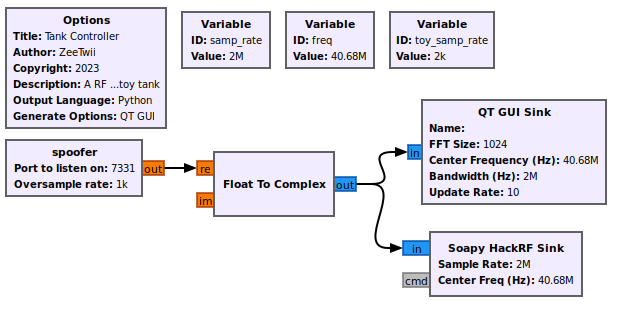

# RF Exploitation demo using RC Tanks


This repo is meant to act as a demo and reference point when doing RF exploitation with GNURadio.  For the purpose of the demo we will be going over how to hack an RC toy, the [RC Fighting Battle Tanks by Liberty Imports](https://www.amazon.com/dp/B00GA97CUG).  At the time of this writing, these are available on Amazon for $25 for the pair.  These tanks are nice to practice and learn with, because they use a very simple AM On Off Keying modulation scheme to communicate.  

## Background

RF Exploitation is a fun field, I've been doing it almost my entire career, but it can be very hard to get into due to there not being many intro level tutorials for people who are RF and looking to use it from a hacking / pen testing standpoint.  Hopefully this guide will help fill that gap and leave you knowing more instead of less.  

## Materials Needed

### Hardware

* A computer able to run [GNURadio](https://github.com/gnuradio/gnuradio)
* [RC Fighting Battle Tanks by Liberty Imports](https://www.amazon.com/dp/B00GA97CUG)
  * Note this is only if you want to follow along directly and try these attacks on your own.  
* A Software Defined Radio capable of transmitting on 27 MHz and 40 MHz
  * The scripts and captures in this tutorial were all done using a [HackRF One](https://greatscottgadgets.com/hackrf/one/)
  * If you only have an [RTL-SDR](https://www.rtl-sdr.com/buy-rtl-sdr-dvb-t-dongles/) or other receive only SDRs, you can still record and decode your own captures but you will not be able to transmit.  

### Software

*  [GNURadio](https://github.com/gnuradio/gnuradio)
* [Inspectrum](https://github.com/miek/inspectrum)
* [Universal Radio Hacker](https://github.com/jopohl/urh)
* (Optional) Spectrum Analyzing software, Some examples are:
  * [QSpectrumAnalyzer](https://github.com/xmikos/qspectrumanalyzer)
  * [SDR#](https://airspy.com/download/)

## The Exploitation Process

Exploiting a system over RF involves three basic steps, Discovering and Identifying the signal, Analyzing said signal for vulnerabilities, and Transmitting your attack.  We're going to go over the following using the RC tank as an example target.  

### Discovery

Depending on what you are trying to exploit, you'll often start with one of two initial problems, either you are trying to figure out on what frequencies a device radiates, or you are noticing a signal in the wild and trying to identify what that device is.  By the nature of our work, we're often times targeting systems that are using non-standard or proprietary data links, and the more documentation and research you can discover about them, the easier your life will get when it comes time to analyze and exploit.  

Lets start with the first problem, since we have the toy tank and are trying to figure out what frequency it radiates on.  In this case the first thing you should do, if in the USA at least, is to look to see if there is an FCC ID somewhere on the device.  If there is, that means the device manufacturer has submitted paperwork to the FCC saying what frequency or frequencies they transmit on, as well as some other information about signal strength, components, etc...  Sites like [FCCID](https://fccid.io/) will let you search the FCC database by FCC ID and list the public documents that the FCC has on the device.  

|   |
|:---:|
|  |
| Note, while useful, this is not an FCC ID |


However in our case, there is a problem.  Neither the tanks nor the controllers have an FCC ID on them, they only have a sticker listing what frequency they transmit on.  This means that we will have to do the analysis ourselves using spectrum analyzer software like [QSpectrumAnalyzer](https://github.com/xmikos/qspectrumanalyzer) and [SDR#](https://airspy.com/download/) to view the spectrum at those frequencies and figure out what is going on.  We're not completely on our own though, tools like the [Signal Identification Wiki](https://www.sigidwiki.com/wiki/Signal_Identification_Guide) exist that can help explain what we see on the waterfall graph the spectrum analyzer generates.  

|   |
|:---:|
|  |
| The above image is taken from SDR# while operating one of the tank controllers |

Above is an image showing what you should see when running one of the spectrum analyzers while operating the tank controller.  In this case we used the controller labeled with the 40MHz operating frequency.  You should notice a couple things when looking at the output of the controller.  

The first is that the controller keeps transmitting on only a single frequency and the power spike it generates oscillates up and down.  This tells us that the base modulation of this signal is amplitude modulation, which means the relative strength of the signal determines the value of the data being transmitted.  Old AM radio towers also use amplitude modulation, its what the AM means.  

The second thing to notice is that the signal continues on as long as you keep the button pushed down.  While we don't have a close enough view to see the actual data, we can infer that this means that the message the controller is transmitting will loop while the button is pressed.  This is actually a big thing to know for latter steps, because it means when we do decode the signal that we will need to look for a repeating pattern that might make up the message.  

The last thing to notice is controller doesn't transmit on 40MHz proper, but is instead slightly off, at 40.68MHz in this case.  This is useful to know, because when transmitting your own signal, you will want to be as close to the real frequency as possible.  

### Analysis

Now that we know the basics of the transmitter signal, its time to go deep and do actual analysis.  But to do that, we will need to record the signal so that we can look more closely at it.  We'll make this recording with this [gnuradio recording flow graph](./rfCapture.grc).  

|   |
|:---:|
|  |
| This is the flow graph we will use to make a recording.  Note the radio doing the capture is a HackRF, however you can swap that block out to match whatever radio you have on hand, such as a RTL-SDR |

This flow graph outputs a IQ file, which is a file that represents RF data via a stream of float pairs that represent the real and imaginary values captured at a given frequency in time.  To view this data, we will use a tool called [Inspectrum](https://github.com/miek/inspectrum) to view and zoom into the signal.  

|   |
|:---:|
|  |
| This is the wide view of the recorded signal displayed on inspectrum |
|  |
| This is the zoomed in view of the signal |

The above images show what you should see when running inspetrum on the captures, either your own or the one provided.  Note, I've changed the power max and power min sliders to remove all the background signals so as to make things clear.  

We notice a couple new things about the signal now that we can zoom in and look at it closely.  The first is that the signal is a long string of pulses of only two states, on and off.  This is the big tell that the actual modulation of these controllers is a modulation known as Amplitude Modulation On-Off Keying or AMOOK.  AMOOK is one of the simplest versions of RF modulation, when the signal is present its a `1` and when its not is a `0`.  This means that if you really wanted to, you could decode this signal into a binary string just by looking at and counting when the pulses are present or not.  We'll actually be using another tool to speed up this process later though.  

The other thing we can make a guess on is the transmission rate of the signal.  By using the cursor tool in inspectrum, we can measure the size of the smallest pulse, which in AMOOK should be a single `1`.  Because we are measuring by hand, we won't be completely exact, so even though the cursor reads 1.9kHz, the actual value is 2kHz transmission rate.  

Now that we have the basic knowledge of the signal, its time to pull out the big guns.  [Universal Radio Hacker](https://github.com/jopohl/urh)(URH) is the closest thing to a one stop demodulator in this space.  The tool does a great job of allowing you to both capture and analyze signals in one location, and will even automate a lot of the decoding process.  However, it's a good idea to know what you expect the data to look like ahead of time, because sometimes the tool will get things wrong, and push out an answer that looks right but isn't.  Some sample captures are found in [captures](./captures/) that you can use in URH to automate the analysis of each of the buttons and extract digital data that makes up messages.  

|   |
|:---:|
|  |
| An example of the URH output |

Depending on if you use the provided captures in URH or do your own, your data may slightly change, however you should see something close enough to the above image.  In the above example, I generated a capture where I pushed the start button on the controller three times.  We can see three blocks of decoded messages, and we can also verify one of our original assumptions that the message repeats.  I'm viewing the data as a hex string, which shows the pattern very easily.  The pattern begins and ends with `0xBB` and contains a string of `0xA` inside.  The number of repeating `0xA` inside the string determine if the message is start\stop, fire, left, right, forward, back.  This means not only is the message a repeating pattern, its what is known as a static message.  

A static message is a message that never changes, for example the start command will always be `0xBBAAAAAAAABB`, no matter how often the system runs or however many other commands are sent.  This is different from something like a WiFi packet, where multiple fields constantly change due to things like counter variables, hashes, etc.  Static messages are great from an RF exploitation standpoint, because it means I can count on the system always reading the message correctly without worrying about the system state.  This also simplifies things from a programming perspective because I can just hard code these values in the code.  

The other thing we can confirm is that each of these actual commands is very short in length, and just looping multiple times in sequence.  This also helps me out, because its easier to code small messages instead of large ones.  

After all of this analysis, we now have everything we need to write our own controller and begin attacking the tank.  

### Transmit

|   |
|:---:|
|  |
| The flow graph used to transmit to the toy tanks |

Now that we know everything, it's time to build the transmitter that we will use to hack the tank.  

To spoof the tank commands in GNURadio, we'll create an Out Of Tree (OOT) module.  OOT modules are any module that doesn't come with vanilla GNURadio, which means anything you make yourself or from someone else.  They're useful for expanding and tailoring a GNURadio flow graph to both specific missions or unique devices, like spoofing a RC tank.  

Within the OOT block, we'll go ahead and hard code each of the possible messages as binary strings.  We can do this because they are all static messages.  An example of what this looks like in the code is:

```python
# both sides forward command
        self.bF = ''
        for char in '101110111010101010101010101010101010101010101010101010101010101010101010101010101010101010101010101010101010101010111011':
            self.bF += char * int(overSample)
```

Notice how we're not just doing the string normally, this is because this code was written for a HackRF, and the HackRF suffers from an undersampling problem when running at low sample rates.  This means that even though the data stream needs to transmit at 2kHz, the slowest our radio will operate at is 1MHz.  This means we have to oversample the signal and turn a single `1` into a long string of them.  That allows our radio to transmit at a high sample rate, while still being readable to the tank radio that is reading at a much slower sample rate.  

There are two ways to induce oversampling.  The most brute force method is to do what we did here in the code.  This forces the entire flow graph to run at that high sample rate, which isn't great, but it also allows you to solve everything within your OOT module.  The other method is to call one of the resampling blocks within GNURadio, and use the rational resampler to increase the sample rate of the data stream right before it hits the radio.  This is done by setting the interpolation field to be whatever value you need the radio to run at, and the decimation field to be the current sample rate.  This block is used a lot in audio transmission, because audio signals have a much lower sample rate than RF signals.  

In addition to spoofing, one of the EW methods we demonstrate is white noise jamming.  This is where you just have the transmitter pushing out noise at power on the same center frequency the receiver is trying to listen on.  In the code this is represented by:

```python
# if jamming set everything to 1 otherwise set everything to zero
        if self.jamming:
            out[:] = float(1)
        else:
            out[:] = float(0)
```

By setting every value of the output stream to `1`, the radio will constantly try to transmit at power.  By setting everything to `0`, we make sure it will only transmit what we want it to later in the code block.  

The other thing that you need to be aware of when transmitting a signal is what the buffer size of the current transmission dump is.  The buffer size of the output isn't constant, and so you need to check to make sure that there is enough room to place all of the signal data, and if not then you need to breakup the transmission and store the extra data for the next pass.  The following code gives an example of how to do that:

```python
# test if out or msg is shorter: only needed for startup
if len(msg) > len(out):
    size = len(out)
    self.oldMsg = msg[size:] # save the untransmitted data for next cycle
    #print(f"message to big, max size {str(size)}")
else:
    size = len(msg)

for i in range(size):
    if msg[i] == '1':
        out[i] = float(1)
    else:
        out[i] = float(0)
```

And that should be all you need to know to hack to your hearts content.  